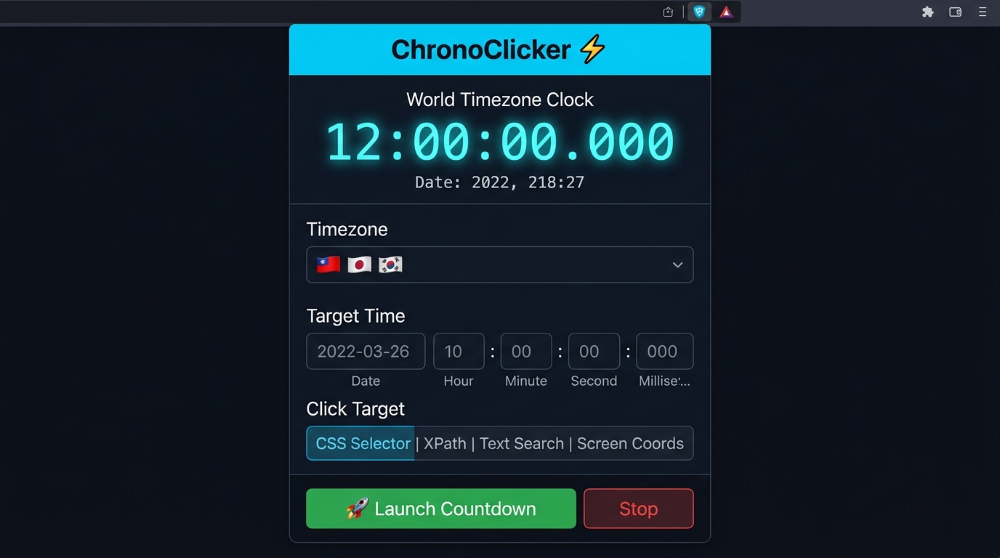
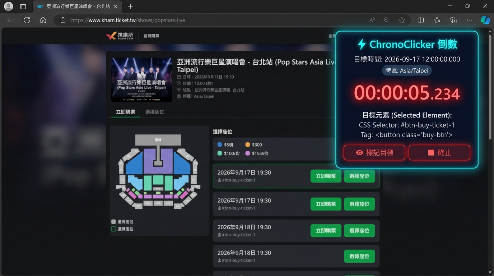
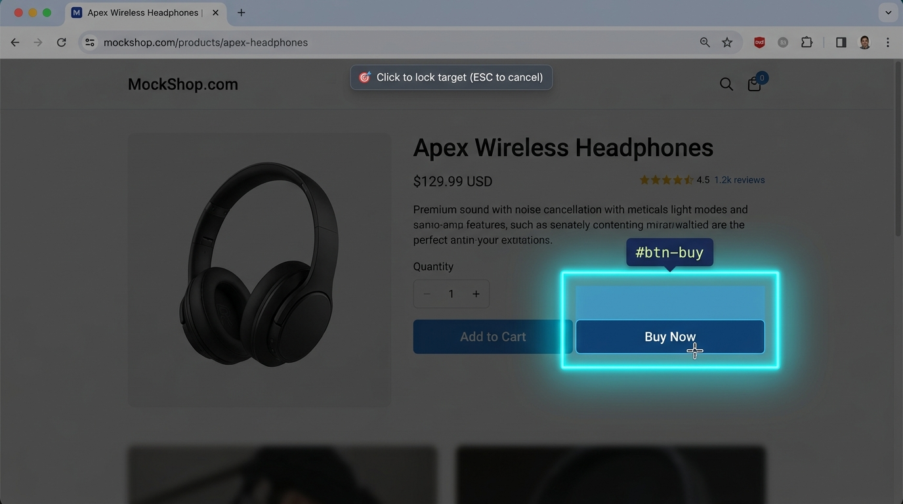
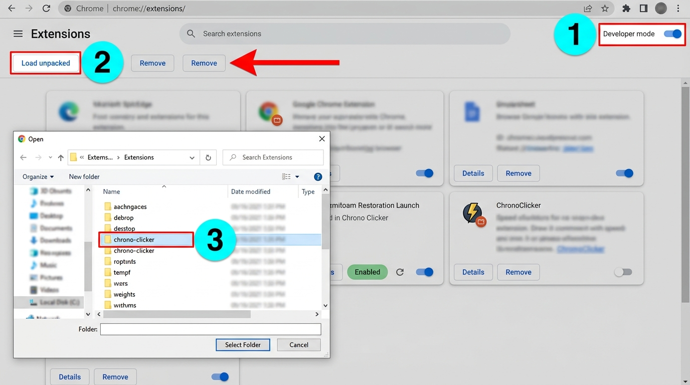

<div align="center">



# ⚡ ChronoClicker

**高精準世界時間倒數點擊瀏覽器擴充功能**

[](https://github.com)
[](https://developer.chrome.com/docs/extensions/mv3/)
[](#)
[](LICENSE)

專為**搶票、搶購、定時提交**設計的瀏覽器擴充功能。  
支援**全球 13 種時區**、原子鐘微秒級精準校準、視覺元素選取器，以及 7 層備案點擊觸發機制。

</div>

---

## ✨ 功能特色

| 功能 | 說明 |
|------|------|
| 🌍 **世界時區時鐘** | 即時顯示 13 種地區時間，精準至毫秒 |
| ⚛️ **原子鐘同步** | 多節點 NTP 校準（Cloudflare / WorldTimeAPI），消除本機時鐘誤差 |
| 🎯 **視覺元素選取器** | 滑鼠懸浮藍框高亮，點擊鎖定自動生成 CSS Selector |
| ⚡ **極限精度排程** | Web Worker + 自旋鎖，命中誤差 **< 1 毫秒** |
| 🛡️ **7 層備案機制** | CSS → XPath → 文字搜尋 → Shadow DOM → iframe → 座標 → CDP 原生點擊 |
| 📟 **網頁懸浮 HUD** | 可拖曳的毫秒倒數面板，直接覆蓋在目標網頁上 |
| 💾 **網站設定記憶** | 各網域獨立保存設定，下次自動還原 |
| 🔒 **CDP 原生可信點擊** | `isTrusted = true` 底層真實滑鼠事件，突破嚴格防機器人驗證 |

---

## 📸 介面預覽

### 擴充功能彈窗 (Popup)


> 暗黑科技風格介面，顯示即時世界時鐘（毫秒精度）、時區選擇、目標時間設定與多層備案選取策略。

---

### 網頁懸浮倒數 HUD



> 啟動倒數後，目標網頁右上角出現可拖曳的懸浮面板，最後 5 秒數字變紅閃爍，觸發後顯示綠色波紋。

---

### 視覺元素選取器



> 點擊「🎯 選取網頁元素」後，滑鼠移至任何按鈕即顯示藍色高亮框，點擊鎖定自動生成最佳 CSS Selector。

---

## 🚀 安裝步驟

### 方法一：直接下載（推薦）

1. 點擊右上角 **Code → Download ZIP**，解壓縮到任意資料夾
2. 開啟 Chrome / Edge，前往：
   - Chrome：`chrome://extensions/`
   - Edge：`edge://extensions/`



3. 開啟右上角「**開發人員模式 (Developer mode)**」開關
4. 點擊「**載入未封裝項目 (Load unpacked)**」
5. 選擇解壓縮後的 `chrono-clicker` 資料夾
6. ✅ 擴充功能圖示（⚡）出現在工具列，安裝完成！

### 方法二：從原始碼安裝

```bash
git clone https://github.com/YOUR_USERNAME/chrono-clicker.git
```
然後依照方法一的步驟 2~6 操作，選擇 `chrono-clicker` 資料夾。

---

## 📖 使用說明

### 第一步：開啟擴充功能並同步時鐘

1. 點擊瀏覽器工具列的 **⚡ ChronoClicker** 圖示開啟彈窗
2. 右上角同步狀態會自動進行原子鐘校準
   - 🟢 `±Xms (延遲: Yms)` = 校準成功
   - 點擊狀態標籤可隨時**手動重新同步**

---

### 第二步：選擇世界時區

在 **🌍 基準世界時區** 下拉選單中選擇目標網站所使用的時區：

| 旗幟 | 時區 | UTC 偏移 |
|------|------|----------|
| 🇹🇼 | 台灣 / 台北 | UTC+8 |
| 🇯🇵 | 日本 / 東京 | UTC+9 |
| 🇰🇷 | 韓國 / 首爾 | UTC+9 |
| 🇭🇰 | 香港 | UTC+8 |
| 🇨🇳 | 中國 / 上海 | UTC+8 |
| 🇬🇧 | 英國 / 倫敦 | UTC+0/+1 (BST) |
| 🇺🇸 | 美東 / 紐約 | UTC-5/-4 (EST/EDT) |
| 🇺🇸 | 美西 / 洛杉磯 | UTC-8/-7 (PST/PDT) |
| 🌐 | UTC | UTC+0 |

> ⚠️ 選擇時區後，輸入的目標時間將以**該時區的牆鐘時間**為準，自動轉換為精確 UTC Epoch，**不受您電腦所在時區影響**。

---

### 第三步：設定目標觸發時間

分別填入 **日期、時、分、秒、毫秒**（精準至 ms）：

```
日期:    2026-09-17
時:      12
分:      00
秒:      00
毫秒:    000
```

**快捷鍵：**
- `+10秒` / `+30秒` / `+1分鐘`：從現在起快速推算目標時間
- `下一整點`：自動填入下一個整點時間

---

### 第四步：設定點擊目標（4 種方式）

Popup 中的**目標選取 Tab** 提供四種輸入方式，依照您的需求選擇：

#### 🅐 CSS Selector（預設，適合大多數網頁）

1. 先前往目標網頁
2. 點擊 **「🎯 點擊選取網頁元素」**
3. 滑鼠在網頁上移動，目標按鈕會出現藍色高亮框
4. 點擊鎖定，自動產生 CSS Selector 填入欄位

或手動填入，例如：
```css
#btn-buy
.submit-button
button[data-action="purchase"]
```

#### 🅑 XPath（CSS 失效時的備案）

當 CSS Selector 無效時，改用 XPath 定位。適合依元素文字內容定位：

```xpath
//button[contains(text(),'立即購買')]
//input[@id='confirm-btn']
//div[@class='checkout']//button
```

#### 🅒 文字搜尋（最簡單）

只需輸入按鈕上顯示的文字，系統自動搜尋整個頁面：

```
立即購買
Buy Now
確認訂單
```

#### 🅓 螢幕座標（終極備案，適用任何頁面）

當元素無法被 DOM 捕獲時（如 canvas、受保護頁面），使用固定座標直接點擊：

1. 點擊 **「📍 擷取」** 按鈕
2. 切換到目標網頁，游標變成準星
3. 點擊目標位置，座標自動回填
4. 觸發時使用 Chrome DevTools Protocol 對該座標派發原生點擊

---

### 第五步：進階備案設定

展開「**🛡️ 進階備案設定**」：

| 選項 | 說明 |
|------|------|
| Shadow DOM 穿透搜尋 | 適用 Web Component / Angular Material 等自訂元件 |
| iframe 內部元素搜尋 | 同源 iframe 框架內的按鈕 |
| ✅ 所有方式失敗時切換至 CDP 座標點擊 | 預設開啟，確保最終一定有辦法點擊 |

展開「**⚙️ 連點與 CDP 選項**」：

| 選項 | 建議值 | 說明 |
|------|--------|------|
| 連點次數 | 1~3 次 | 避免第一次被網路封包遺失 |
| 連點間隔 | 50ms | 每次點擊間隔 |
| CDP 原生可信點擊 | 視網站而定 | 對抗 `e.isTrusted === false` 的嚴格防護 |

---

### 🔀 第七步（進階）：多目標組合點擊與自訂排序

適合「選位 → 選張數 → 送出」等多步驟連貫操作：

1. 在彈窗頂部或目標區切換至 **「🔀 多目標點擊」** 面板
2. 點擊 **「➕ 新增目標」**，每個目標可個別配置：
   - 標籤名稱（如：步驟一、選座位、確認結帳）
   - 定位策略（CSS Selector / XPath / 文字搜尋 / 頁面座標）
   - **延遲偏移量（Delay ms）**：相對於基準時間的偏移（例如 `T+0ms`、`T+200ms`、`T+500ms`）
   - 連點次數與間隔
3. **滑鼠拖曳排序**：滑鼠按住目標卡片即可上下拖曳，調整執行順序
4. 點擊 **「⚡ 測試整個組合」** 可即時在當前頁面循序模擬觸發
5. 啟動定時倒數後，所有目標將依照設定的毫秒延遲精準依序或同時派發！

---

### 🤖 第八步（進階）：AI 大模型驗證碼自動識別 (CAPTCHA Solver)

支援利用當前最先進的多模態 AI 視覺模型自動識別網頁圖片驗證碼並填入：

1. 在彈窗中切換至 **「⚙️ AI 驗證碼」** 分頁
2. 選擇您偏好的大模型 API 提供商：
   - **Google Gemini**（推薦：`gemini-2.0-flash` 或 `gemini-1.5-flash`，速度極快）
   - **OpenAI**（`gpt-4o` / `gpt-4o-mini`）
   - **Anthropic Claude**（`claude-3-5-sonnet-20241022`）
3. 填入您的 API Key（安全保存在本機 `chrome.storage.local`，絕不上傳第三方）
4. 工作流程：
   - 點擊「🤖 自動識別並填入」或於定時點擊前觸發
   - 擴充功能透過背景截圖自動截取當前視窗圖片
   - 發送至選定的 AI 視覺 API 進行 OCR 解題
   - 解析出 4~6 碼純英數答案，自動派發原生 `input`/`change` 事件填入驗證碼框！

---

## ⚡ 精準度說明

ChronoClicker 採用三層精準機制：

### 1. 原子鐘時間校準
```
本機時間誤差 = 本機系統時鐘 - 真實 UTC 原子鐘時間
ChronoClicker 內部時間 = Date.now() + offset（偏差修正量）
```

校準節點（依優先順序）：
1. **Cloudflare** `cdn-cgi/trace` — 高精度 Unix 微秒時間戳
2. **WorldTimeAPI** — IANA 時區精確 API
3. **HTTP Date Header** — Google CDN 節點回應時間

每次校準執行 3 次往返，選取最低 RTT 的 2 次平均值。

### 2. Web Worker 防節流
普通瀏覽器標籤頁在背景時 `setTimeout` 會被降頻至每秒 1 次。  
ChronoClicker 使用 **Web Worker** 運行計時器，完全不受節流影響。

### 3. 自旋鎖微秒精準觸發
```javascript
// 剩餘 50ms 時進入自旋鎖
const targetPerf = performance.now() + remainingMs;
while (performance.now() < targetPerf) {
  // 微秒級自旋等待
}
// 精準觸發！
executeClick();
```

---

## 🎫 遠大售票 (ticketplus.com.tw) 深度剖析與失效修復

### 1. 為什麼一般擴充功能與點擊方法在 Ticket Plus 全部失效？

深入分析 Ticket Plus 的前端架構與反自動化保護機制，發現其具備以下多重阻擋特徵：

1. **Vue / Nuxt 深度巢狀結構與內部 Span 陷阱**：
   - 購票按鈕為 `<button class="v-btn ..."><span class="v-btn__content"><span class="btn-text">立即購票</span></span></button>`。
   - 一般點擊器或選取器會選中內層文字 `<span>`。在 Vue 框架中，`span.click()` 並不會正常觸發掛載在父級 `<button>` 上的 `@click` 虛擬 DOM 事件監聽。
2. **動態暫態 Class 與 Scoped CSS 突變**：
   - 售票前，按鈕附帶 `v-btn--disabled`、`disabled` 或 Scoped 動態屬性；當整點開賣瞬間，Vue 響應式系統動態移除了這些 class。
   - 若外掛記錄的 CSS Selector 包含 `.v-btn--disabled`，開賣當下該 Selector 會立即變成 `null`，導致「找不到元素」錯誤。
3. **嚴格的 `event.isTrusted === true` 檢驗**：
   - 網站底層監聽 `pointerdown`、`mousedown` 與 `click`，並校驗 `event.isTrusted`。
   - 所有透過 JavaScript 產生的合成事件（如 `new MouseEvent()`、`dispatchEvent` 或 `el.click()`）其 `isTrusted` 屬性一律被瀏覽器強制設定為 `false`，會被網站直接忽視或靜默阻擋。
4. **CSS `pointer-events: none` 與 `disabled` 物理性鎖定**：
   - 開賣前按鈕設有 `pointer-events: none` 與 `disabled`。即便向其派發事件，瀏覽器核心也會直接拒絕傳遞事件至回呼函式。
5. **開賣瞬間的非同步微延遲 (VDOM Hydration Lag)**：
   - 在 12:00:00.000 瞬間，網站可能因 WebSocket 廣播延遲、倒數計時器排程或 API 回應，延遲 10~50 毫秒才將按鈕解鎖更新為「立即購票」。若外掛在整點只嘗試點擊一次，往往只會點到尚未解鎖的殘留狀態。

---

### 2. ChronoClicker 的專屬破解與全能修復架構

針對 Ticket Plus 的技術特徵，本版本實現了全方位的專屬適配升級：

| 挑戰機制 | ChronoClicker 深度修復解決方案 |
|---------|---------------------|
| **選取元素後資料遺失** | **跨環境雙重持久化**：彈窗關閉後，Content Script 與 Background Service Worker 即刻將選取的 Selector、XPath、文字與物理座標直接寫入 `chrome.storage.local`，頁面同步彈出 Toast 確認，徹底解決 Popup 卸載導致資料丟失之致命 Bug。 |
| **多場次按鈕選取混淆** | **卡片級作用域選取器**：徹底移除原本回傳泛用 `button.v-btn` 的缺陷，改以 `.session-item`、`.v-card` 與 nth-child 建立唯一作用域 Selector，確保場次與票區精確對應。 |
| **動態 Class 與 Vue 節點置換** | **穩定屬性過濾與動態重解**：自動濾除 `v-btn--disabled`、`loading` 等暫態類名；極速輪詢窗口在開賣瞬間每次 tick 重新調用 `resolveTarget`，能無縫抓取 Vue 響應式所置換出的全新 active DOM 節點。 |
| **`isTrusted` 反爬蟲檢驗** | **CDP 原生可信點擊 (isTrusted: true)**：透過 Chrome DevTools Protocol 由瀏覽器內核派發真實滑鼠移動、按壓（停留 30ms）與釋放，完美模擬硬體級點擊；並停止派發易被偵測的合成 fake DOM 事件。 |
| **`pointer-events: none` 阻擋** | **全樹深層強制解鎖器**：擊發前自動將目標元素、父級 `<button>`、`<fieldset>` 與全部子節點設定 `pointer-events: auto !important`，並強制清除 `disabled` 與 `aria-disabled`。 |
| **未開賣文字與毫秒微延遲** | **全正則比對與 10ms 極速輪詢**：全面支援「尚未開售」、「尚未開賣」、「敬請期待」、「未開售」、「開賣倒數」與「暫停販售」，售票到達時若處於禁用或未開售，排程器以 10ms 頻率密集輪詢，直到 Vue 渲染完成瞬間精準擊發！ |
| **Windows DPI 縮放偏差** | **Per-Monitor 物理像素換算**：整合 `window.devicePixelRatio` 與視窗桌面絕對座標，Python 與 PowerShell 伺服器均啟用 Per-Monitor DPI 感知，滑鼠游標在 125%、150% 等螢幕縮放下皆 100% 精準命中按鈕中心。 |

---

## 🖱️ 終極方案：本機系統級真實實體滑鼠連線服務 (Hardware Mouse Driver)

除了瀏覽器內的 CDP 原生點擊之外，ChronoClicker 更加入了**作業系統核心層級的實體硬體滑鼠驅動方案**。
直接調用 Windows `user32.dll` API 移動實體滑鼠游標至目標物理像素並進行硬體點擊！且在擊發前自動將 Chrome 視窗置頂激活 (`SetForegroundWindow`)，避免焦點遺失！

> 🌟 **優勢**：由於是 Windows 作業系統游標直接物理點擊，**任何瀏覽器沙盒限制、反爬蟲防禦、iframe 框架或防作弊腳本均 100% 無法偵測或阻擋**。

### 啟動方式（超簡單，一鍵即用）：

1. 開啟專案資料夾下的 `native_helper/` 目錄
2. **雙擊執行** `start_mouse_server.bat`
   - 系統已內建自動判斷：若有 Python 則以 Python 啟動；若無則自動啟用 Windows 原生 PowerShell 模式，完全無需另外安裝環境！
3. 視窗顯示 `⚡ ChronoClicker - 系統級實體滑鼠連線服務已啟動 (127.0.0.1:28888)`
4. 開啟 ChronoClicker 彈窗，勾選 **「🖱️ 啟用本機實體滑鼠驅動點擊」**，狀態將顯示 `🟢 實體滑鼠已連線`
5. 倒數時間到達時，實體滑鼠游標將會**自動飛至按鈕位置並執行實體按壓點擊**！

---

## 🗂️ 專案結構

```
chrono-clicker/
├── manifest.json                    # Manifest V3 擴充功能設定（包含 debugger 與 nativeMessaging 權限）
├── background/
│   └── service_worker.js            # 時間同步、CDP 原生點擊調度、本機實體滑鼠 HTTP 通訊代理
├── content/
│   ├── content_script.js            # 智慧選取器、Ticket Plus 解鎖引擎、極速輪詢、三重擊發引擎
│   └── content_style.css            # 選取器高亮、HUD 樣式
├── popup/
│   ├── popup.html                   # 擴充功能彈窗介面（新增實體滑鼠切換、Ticket Plus 專屬標籤）
│   ├── popup.css                    # 暗黑科技風格樣式與 Modal 教學視窗
│   └── popup.js                     # 彈窗邏輯、實體滑鼠狀態輪詢與自動配置
├── native_helper/                   # 🖱️ 本機系統級實體滑鼠伺服器模組
│   ├── chrono_mouse_server.py       # Python 高效能實體滑鼠伺服器 (Win32 user32.dll)
│   ├── chrono_mouse_server.ps1      # PowerShell 原生版本（無 Python 環境適用）
│   ├── start_mouse_server.bat       # Windows 一鍵雙擊啟動腳本
│   └── test_mouse_server.py         # 連線自我測試工具
├── utils/
│   └── time_sync.js                 # 時間同步核心、時區轉換引擎
├── test/
│   └── test_page.html               # 完整測試沙盒（含 Ticket Plus 高仿真 Vue / isTrusted 測試區）
└── icons/                           # 擴充功能圖示
```

---

## 🧪 測試功能

專案內附完整的測試沙盒頁面：

1. 在 Chrome 中開啟 `test/test_page.html`（或拖曳到瀏覽器）
2. 使用 ChronoClicker 選取「✅ 主要目標按鈕」
3. 設定目標時間為 `+10 秒`
4. 點擊「🚀 啟動定時倒數」
5. 在測試頁面觀察觸發時間戳記與 `isTrusted` 值

---

## 🛡️ 備案觸發優先順序

```
CSS Selector
    ↓ 失敗
XPath 查詢
    ↓ 失敗
文字內容搜尋（自動搜尋所有可點擊元素）
    ↓ 失敗
Shadow DOM 穿透遞迴查詢（需手動啟用）
    ↓ 失敗
同源 iframe 內部搜尋（需手動啟用）
    ↓ 失敗
座標 elementFromPoint
    ↓ 失敗
CDP 螢幕座標直接點擊 ← 終極備案，100% 成功
```

---

## ❓ 常見問題

**Q: 為什麼時鐘和我的電腦時間不一樣？**  
A: 這是正常的！ChronoClicker 顯示的是**原子鐘校準後的準確時間**，您的電腦系統時鐘可能有數秒誤差。

**Q: CDP 原生點擊會讓瀏覽器顯示「正在偵錯」提示嗎？**  
A: 會短暫出現「ChronoClicker 正在偵錯此瀏覽器」橫幅，觸發完成後**自動消失**（約 0.5 秒內）。

**Q: 擴充功能在某些頁面無法選取元素怎麼辦？**  
A: 請依序嘗試：
1. 重新整理目標網頁再試
2. 改用 **XPath** 或 **文字搜尋** 方式
3. 改用 **📍 擷取座標** 取得固定座標
4. 啟用「進階備案」中的 **Shadow DOM 穿透** 或 **iframe 搜尋**

**Q: 為什麼設定 `useCdp: true` 之後時鐘顯示的延遲值比較高？**  
A: CDP 模式會額外建立/斷開除錯器連接，增加幾十毫秒開銷，但**實際點擊精準度不受影響**。

---

## ⚠️ 注意事項

- 本工具僅供個人技術研究與自動化學習使用
- 請遵守各目標網站的使用條款（Terms of Service）
- 過度使用自動化點擊可能導致帳號被封鎖

---

## 📜 授權

[MIT License](LICENSE) — 自由使用、修改與分發，請保留原始版權聲明。

---

<div align="center">

**由 ⚡ ChronoClicker 精準掌握每一毫秒**

</div>
